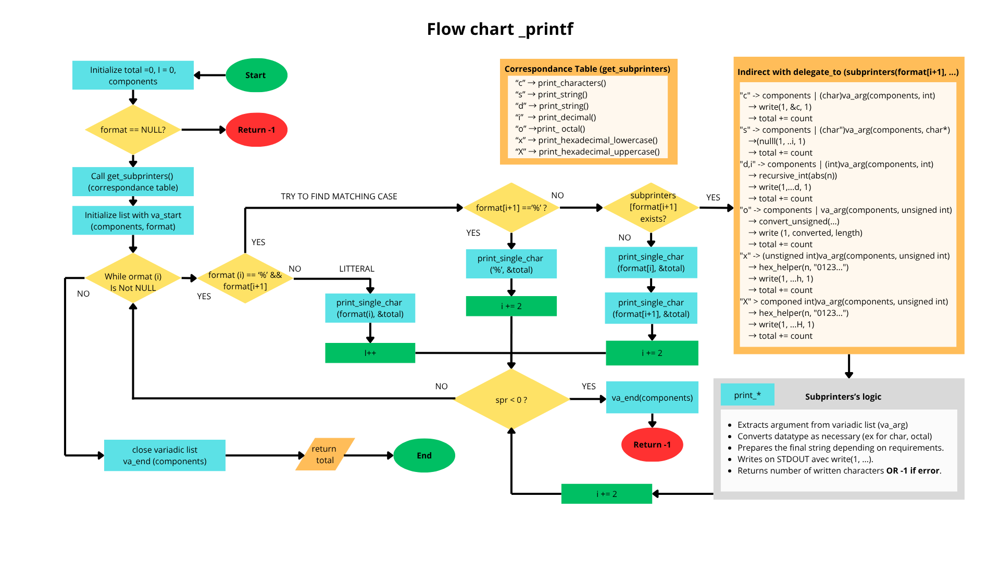

# Printf partial rewrite: _printf

## Table of content
- [Overview](#overview)
  - [Summary](#summary)
  - [Copyright](#copyright)
- [How to install and run](#how-to-install-and-run)
  - [Prerequisites](#prerequisites)
  - [1. Downloading](#1-downloading)
  - [2. Compiling](#2-compiling)
  - [3. Starting program](#3-starting-program)
- [How to use](#how-to-use)
  - [Usage overview](#usage-overview)
  - [Features](#features)
  - [Accessible help](#accessible-help)
  - [Important rules and limitations](#important-rules-and-limitations)
  - [Examples of use](#examples-of-use)
    - [Valid examples](#valid-examples)
    - [Failing examples](#failing-examples)
- [Technical information](#technical-information)
  - [General architecture](#general-architecture)
    - [Process flow](#process-flow)
    - [Source code file structure](#source-code-file-structure)
  - [Testing](#testing)
    - [Technologies](#technologies)

## Overview

_printf is a command allowing the display of dynamically aggregated informations  
  by replacing parts of a provided string with data from other sources.

### Summary
This project aims at demonstrating how to create a simple function
  to display ("print on terminal") different kind of informations
  in various ways, which can be summarized as "isolated characters",
  "full sentences" and "integer numbers displayed in different variants".  
Please note that this is a simplified version with a limited feature set.  
Refer to the [How to use](#how-to-use) section for more details.

### Copyright
This program has been developed by...
* Erwan Barat
* Laurent Lacôte

It is distributed under terms of the GPL v3.0, confer [LICENSE](LICENSE.md) file for details.

## How to install and run
### Prerequisites
You must have the packages/tools related to C
  installed on your system, as well as a "compiler"
  (program used to "prepare" this tool for your machine).
In case that helps here are online resources to install
  those tools depending on your operating system
  * Windows: https://learn.microsoft.com/en-us/cpp/build/walkthrough-compile-a-c-program-on-the-command-line?view=msvc-170
     and https://nullprogram.com/blog/2016/06/13/
  * Mac: https://www.cs.auckland.ac.nz/~paul/C/Mac/
  * Linux (deb package system): https://jvns.ca/blog/2025/06/10/how-to-compile-a-c-program/

### 1. Downloading
If you have git and are comfortable with command line,
  you can simply open one and go to the directory in which you want calculator to be.
  Then run (without the quotes) `"git clone https://github.com/llacote-holberton/holbertonschool-printf.git"`
Otherwise you can simply download a zip containing all projects file
  by following [this url](https://github.com/llacote-holberton/holbertonschool-printf/archive/refs/heads/main.zip)
  then unfolding it where you want on your computer.

### 2. Compiling
Open the terminal, go inside the project directory (the one created from git clone or unzip).
Then type the following command (without quotes if you're reading this as raw text).
`gcc -Wall -Werror -Wextra -pedantic -std=gnu89 *.c -o custom_partial_printf_demo.out`  

**NOTE**: per express requirement from client, the "main" function which is normally required for any C program to run
  is *NOT* provided officially.  
So you will need to write your own source code implementing the "main" function and add it in the same directory.

With that said, if you just want a demonstration of its output, we provide a dedicated "test main" you can use at leisure.
Just add it to the list of files to include in compilation like so.
`gcc -Wall -Werror -Wextra -pedantic -std=gnu89 -Wno-format *.c tests/test_main.c -o custom_partial_printf_demo.out`

Please be aware that for our demo example the -Wno-format flag is REQUIRED to pass compilation, as we make "side-by-side" comparisons
  between "custom printf" and "official printf" rendering including in cases which are normally unsupported by printf (thus rejected by compiler).

### 3. Starting program
Open a terminal place yourself in the directory in which you have downloaded/extracted the project then compiled an executable,  
and just type ./<executable-name>  (for example for the "demo executable" it would be `./custom_partial_printf_demo.out`).

## How to use

### Usage overview
To use _printf simply call it while respecting its required syntax.
```
  _printf( format , ...);
             |        |
             |        +--> variadic list of additional data to format.
             +--> "instruction chain" (plain text and special characters triggering a replacement).
```

Format argument is mandatory (although it can technically be an empty string).
Each additional argument must be separated by a comma (',').

The "format" string can be of any desired length.
By default, the characters it contains will be outputted as is on the standard output (terminal screen).
However, each time you enter a "conversion delimiter" character ('%') paired with a supported conversion identifier,
  program will try and use the *matching* argument in the list you provide after the first.
  
For example... Let's say we print a oneline about how much money a user possesses.
```
    _printf("Hello %s, current credit: %d dollars.\n", "Alice", 30);
                   |                    |                |       |
                   |                    |                |       +--> argument 2 (int)
                   |                    |                +----------> argument 1 (string)
                   |                    |
                   |                    +--> %d = expects second variadic argument to be integer.
                   +-----------------------> %s = expects first additional argument to be string.
```
As you can see in this example, we have two replacements.
'%' (conversion delimiter) immediately followed by 's' (conversion identifier) create a "conversion command"
    replacing those two characters with the whole content of a string provided through another variable.
'%' (conversion delimiter) immediately followed by 'd' (conversion identifier) create a "conversion command"
    replacing those two characters with the integer number contained in another variable.

The output displayed will be as follows ((\n meaning "go to a new line")).
```
Hello Alice, current credit: 30 dollars.

```
For more detailed examples, confer the dedicated section [Examples of use](#examples-of-use).

### Features
This program only supports the following conversion commands.

| Conversion command | Description of what command does.                                                         | Required type for matching argument in variadic list |
|--------------------|-------------------------------------------------------------------------------------------|------------------------------------------------------|
| '%c'               | Replaces with a single character                                                          | char                                                 |
| '%s'               | Replaces with a whole string                                                              | char*                                                |
| '%d'               | Replaces with an integer "as provided"                                                    | int                                                  |
| '%i'               | Replaces with an integer "as provided"                                                    | int                                                  |
| '%u'               | Replaces with an unsigned integer (>=0) "as provided".                                    | unsigned int                                         |
| '%o'               | Replaces with an octal representation  of a provided unsigned integer.                    | unsigned int                                         |
| '%x'               | Replaces with a hexadecimal representation (in lowercase) of a provided unsigned integer. | unsigned int                                         |
| '%X'               | Replaces with a hexadecimal representation (in uppercase) of a provided unsigned integer. | unsigned int                                         |
|                    |                                                                                           |                                                      |

IMPORTANT: function has a two-branche return: if the whole writing was successful, it will return the total number of characters printed.
If at any moment writing fails for any reason, function immediately stops parsing format and will return -1.

### Accessible help
You can consult the associated help by typing the following command while at the root directory of this project.
`man ./ _printf.3`.

In case you would prefer adding it to your manpages database, you can type in these commands
  (you will need root privileges on your system if you plan on adding for all users by copying to /usr/share/man/man3/).
```
mkdir -p ~/.local/share/man/man3/        # OPTIONAL: in case it doesn't exist already.
cp ./_printf.3 ~/.local/share/man/man3/  # Copy to the right section.
mandb                                    # Force the reconstruction of manpages index
man 3 _printf                            # Will now work wherever you are.
```

### Important rules and limitations
1. **Only the aforementioned conversion commands are supported.** Pairing % with any other character will result in both being printed literally (ex %z).
   This is a difference with official printf which may sometimes try to interpret them and end up with undefined behaviour.
2. **When format contains valid conversion commands, arguments which follow MUST match the conversion specifiers in both order and expected type.**
   Program cannot guarantee behaviour if this requirement is not fulfilled.
3. This program only supports the aforementioned features. If you need more formatters or advanced formatting options such as padding, limiting number of decimals etc please consider using the official printf from C standard library instead.
4. There is a special case for which _printf reproduces standard printf behaviour: when detecting '%%', only one will be printed out.


### Examples of use

#### Valid examples
| Use case                     | Source code                               | Output                 | N° of printed chars |
|------------------------------|-------------------------------------------|------------------------|---------------------|
| %c — Single character        | _printf("Character: %c\n", 'A');          | Character: A           | 13                  |
| %s — String                  | _printf("String: %s\n", "Hello, World!"); | String: Hello, World!  | 21                  |
| %d — Signed decimal integer  | _printf("Degrees: %d\n", -42);            | Degrees: -42           | 13                  |
| %i — Signed decimal integer  | _printf("Score: %i\n", 1337);             | Score: 1337            | 12                  |
| %u — Unsigned decimal integer| _printf("Population: %u\n", 4294967295u); | Population: 4294967295 | 23                  |
| %b — Binary representation   | _printf("2 (b10) equals %b (b2)\n", 2);   | 2 (b10) equals 2 (b2)  | 23                  |
| %o — Octal representation    | _printf("Permissions: %o\n", 493u);       | Permissions: 755       | 17                  |
| %x — Hexadecimal lowercase   | _printf("Color: %x\n", 255u);             | Color: ff              | 10                  |
| %X — Hexadecimal uppercase   | _printf("Color: %X\n", 255u);             | Color: FF              | 10                  |

#### Failing examples
Examples of faulty call ending in undefined behaviour.
```_printf("Hello %s, current credit: %d dollars.\n", 30, "Bob");```
  => Argument list provides variables of the right type, but the order mismatches the one of conversion commands.
```_printf("Hello %s, current credit: %d dollars.\n", "Bob");```
  => One argument is missing.
```_printf("Hello %s, current credit: %u dollars.\n", 'Z', -666);```
  => Good number of arguments, good order but second argument is signed int and %u expects an unsigned one.

## Technical information

### General architecture

This C program has been written with the help of GCC for compiling,
Valgrind for memory testing and Git for collaboration.

It revolves about the continuous parsing of the first provided argument ("format" string), either...
* Printing characters literally (by default).
* Or using delegated "printer functions" (called "subprinters") to replace parts of the string when reaching a valid conversion command.

It ends either when a failure has happened during one write operation (then returns -1 to indicate error happened)  
or when format string has been fully parsed (then returns total characters printed on output), whichever comes first.

#### Process flow


#### Notes on architecture choices

1. Contrarily to printf, we print literally a character following % but not recognized as a supported conversion identifier "as a literal character". This difference comes from the fact that printf has a much wider range of features and as such often tries to "parse several consecutive characters" to find a pattern... Ending in failure in case there is no exploitable pattern. As our function is much simpler it allows us to act differently.

2. For file structure we tried to be as clear as possible but our initial stance of "one function per file" evolved a bit when actual coding start. We diverged a bit from that stance in that some functions have been written "inline aside" their associated function as it didn't make much sense to "expose" them (not really reusable ones).

#### Source code file structure
| Filename                     | Role                                                                                                 | Functions in file               |
|------------------------------|------------------------------------------------------------------------------------------------------|---------------------------------|
| main.h              | Custom header holding all "public-facing" functions, structures and constants.       | All prototypes except get_subprinters & delegate_to      |
| _printf.c           | Orchestrator: defines printers and manages main parsing loop delegating as needed.   | _printf, get_subprinters, delegate_to, print_single_char |
| print_character.c   | Uses variadic argument to print single character                                     | print_character                                          |
| print_string.c      | Uses variadic argument to print string                                               | print_string                                             |
| print_decimal.c     | Uses variadic argument to print (signed) integer as is (covers both '%d' and '%i')   | print_decimal                                            |
| print_unsigned.c    | Prints variadic unsigned integer in a decimal representation                         | print_uint  (different name because of a bug in Betty )  |
| print_binary.c      | Prints variadic unsigned integer in a binary representation                          | print_binary                                             |
| print_octal.c       | Prints variadic unsigned integer in an octal representation                          | print_octal                                              |
| print_hexadecimal.c | Prints variadic unsigned integer in an hexadecimal (low|upp)ercase representation    | print_hexadecimal_uppercase, print_hexadecimal_lowercase, hex_helper |
| utils.c             | Holds utility functions                                                              | change_integer_base                                      |

NOTE: we decided to try and follow a "one function per file" approach but in practice it made sense to have exceptions when...
- Some functions were very close to one another in behaviour (ex hexadecimal in lowercase and uppercase).
- Some functions had no value outside of one single call made to them in another function (typically get_subprinters, recursive_int).

### Testing
Each formatter has been tested with its own "test case" in our "test main" file.
Program only uses stack memory overall, with an expected peak consumption at any time of about 250 bytes in the context of the provided test_main.c demonstration code.

Absence of memory leak has been checked through the use of the Valgrind debugging tool, with the following command
`valgrind --leak-check=full --show-leak-kinds=all --track-origins=yes --verbose          --log-file=valgrind-out.txt <path_to_executable>`.
Note that in case tracability is wanted you can ask Valgrind to write down to a file with option `--log-file=<filename>`.
Result shows clean execution.
```
==10== 
==10== HEAP SUMMARY:
==10==     in use at exit: 0 bytes in 0 blocks
==10==   total heap usage: 1 allocs, 1 frees, 1,024 bytes allocated
==10== 
==10== All heap blocks were freed -- no leaks are possible
==10== 
==10== For lists of detected and suppressed errors, rerun with: -s
==10== ERROR SUMMARY: 0 errors from 0 contexts (suppressed: 0 from 0)
```

#### Technologies
<p align="left">
    
    
    
    
    
    
</p>
